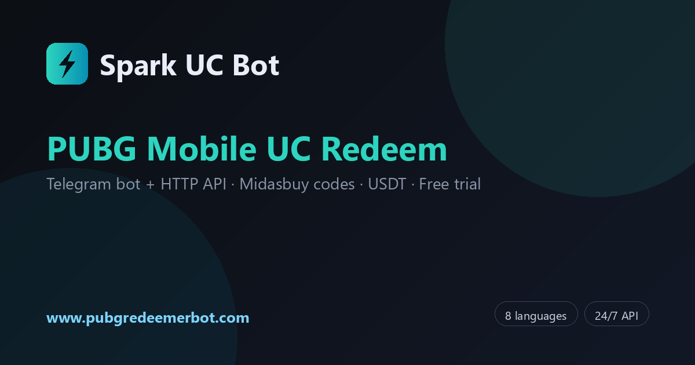
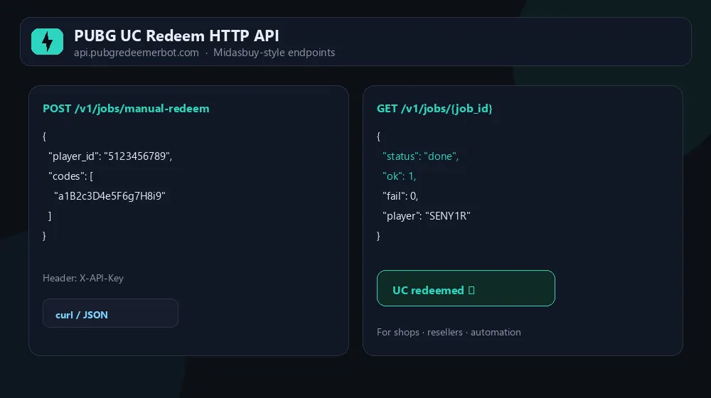
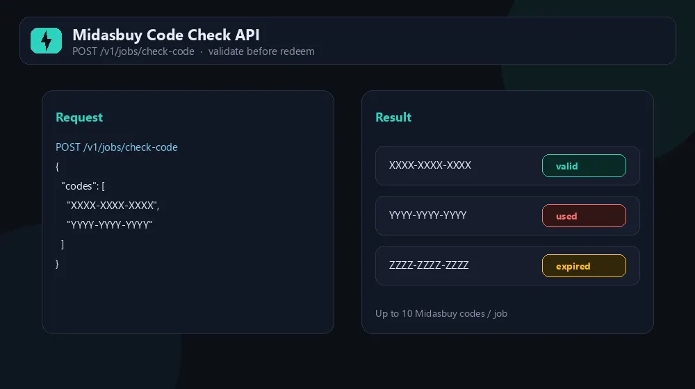
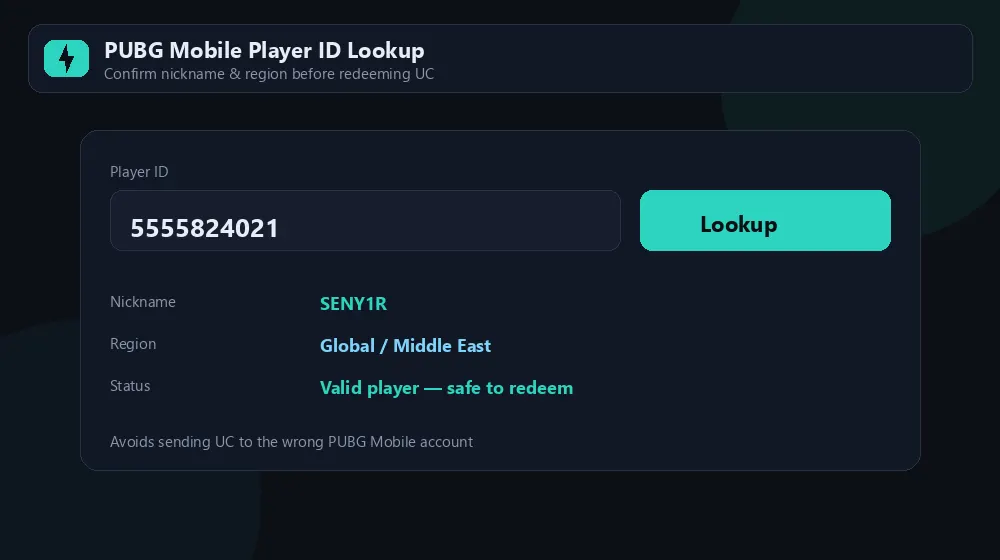

# Midasbuy API for PUBG Mobile UC — Spark UC Bot HTTP API

> **Independent developer API** for Midasbuy-style PUBG Mobile UC voucher **redeem**, **code check**, **player lookup**, and **stock batch** automation.  
> Not affiliated with Midasbuy, Krafton, or Tencent.

[](https://telegram.me/SparkUCBot)
[](https://api.pubgredeemerbot.com/docs)
[](https://api.pubgredeemerbot.com/swagger)
[](https://www.pubgredeemerbot.com/midasbuy-api.html)

**Languages:** [English](./README.md) · [العربية](./README.ar.md) · [Русский](./README.ru.md) · [اردو](./README.ur.md) · [فارسی](./README.fa.md) · [Türkçe](./README.tr.md) · [हिन्दी](./README.hi.md) · [中文](./README.zh-CN.md)



---

## What is this?

**Spark UC Bot** exposes a production **HTTP REST API** at `https://api.pubgredeemerbot.com` that processes **Midasbuy-style PUBG Mobile UC redemption codes** — the same pipeline used by the Telegram bot [@SparkUCBot](https://telegram.me/SparkUCBot).

Use it to:

- **Redeem UC codes** to a Player ID (`POST /v1/jobs/manual-redeem`)
- **Check / validate vouchers** before you sell or redeem (`POST /v1/jobs/check-code`, up to 10 codes per job)
- **Lookup player nickname & region** before redeem (`GET /v1/player/lookup`)
- **Batch redeem from uploaded stock** (`POST /v1/jobs/stock-redeem`)
- Read **account, quota, history, and stock summary**

Perfect for **reseller panels**, **shops**, **automation scripts**, and **SaaS integrations**.

### Screenshots







---

## Quick links

| Resource | URL |
|----------|-----|
| **API base** | https://api.pubgredeemerbot.com |
| **HTML documentation** (copy-paste examples) | https://api.pubgredeemerbot.com/docs |
| **Swagger UI** (try endpoints) | https://api.pubgredeemerbot.com/swagger |
| **OpenAPI JSON** | https://api.pubgredeemerbot.com/openapi.json |
| **Health check** | https://api.pubgredeemerbot.com/health |
| **Landing page** (SEO + 8 languages) | https://www.pubgredeemerbot.com/midasbuy-api.html |
| **Telegram bot** | https://telegram.me/SparkUCBot |
| **Support** | https://telegram.me/sparkuc_support |

---

## Disclaimer

This is **Spark UC Bot** (pubgredeemerbot.com) — an **independent** service. We are **not** Midasbuy, Krafton, Tencent, or PUBG Mobile.  
PUBG® and related marks belong to their owners. You must comply with the game's terms of service.

---

## Authentication

All `/v1/*` and `/api/v1/*` routes require your API key in the header:

```http
X-API-Key: YOUR_API_KEY
```

Get your key in Telegram: **@SparkUCBot** → subscribe to a plan → purchase **HTTP API add-on** → copy key from the API menu.

**Requirements:** active subscription plan + **HTTP API add-on** (15 USDT / 30 days). Admin may grant a free API trial on request.

---

## Core endpoints

Base URL: `https://api.pubgredeemerbot.com`

| Method | Path | Description |
|--------|------|-------------|
| `GET` | `/health` | Public health check |
| `GET` | `/v1/me` | Account snapshot (balance, subscription) |
| `GET` | `/v1/quota` | Daily limits & usage |
| `GET` | `/v1/player/lookup` | Player nickname lookup (sync; 0.25 quota on success) |
| `POST` | `/v1/jobs/manual-redeem` | Redeem UC code(s) to Player ID (async job) |
| `POST` | `/v1/jobs/check-code` | Validate voucher(s) without redeem (async job) |
| `POST` | `/v1/jobs/stock-redeem` | Redeem from uploaded stock inventory (async job) |
| `GET` | `/v1/jobs/{job_id}` | Poll job status & result |
| `GET` | `/v1/jobs` | List recent jobs (paginated) |
| `GET` | `/v1/history` | Redemption history (paginated) |
| `GET` | `/v1/stock/summary` | Stock counts by denomination |
| `POST` | `/api/v1/order/screenshot` | ORDER DETAILS image (WebP) from completed job |

Full reference: [docs/ENDPOINTS.md](./docs/ENDPOINTS.md) · Live: [api.pubgredeemerbot.com/docs](https://api.pubgredeemerbot.com/docs)

---

## Integration in 3 steps

### 1. Subscribe + API add-on

Open [@SparkUCBot](https://telegram.me/SparkUCBot) → top up USDT → choose a daily plan → buy **HTTP API add-on** → copy your API key.

### 2. Create a job

```bash
curl -X POST "https://api.pubgredeemerbot.com/v1/jobs/manual-redeem" \
  -H "X-API-Key: YOUR_API_KEY" \
  -H "Content-Type: application/json" \
  -d '{"player_id":"5123456789","codes":["XXXX-XXXX-XXXX-XXXX"]}'
```

Response includes `job_id` immediately.

### 3. Poll until done

```bash
curl -s "https://api.pubgredeemerbot.com/v1/jobs/JOB_ID" \
  -H "X-API-Key: YOUR_API_KEY"
```

Repeat until `status` is `done` or `failed`. Redeem and check-code are **async**; player lookup is **synchronous**.

More examples: [docs/QUICKSTART.md](./docs/QUICKSTART.md)

---

## Check code before redeem

```bash
curl -X POST "https://api.pubgredeemerbot.com/v1/jobs/check-code" \
  -H "X-API-Key: YOUR_API_KEY" \
  -H "Content-Type: application/json" \
  -d '{"codes":["XXXX-XXXX-XXXX-XXXX","YYYY-YYYY-YYYY-YYYY"]}'
```

Then poll `GET /v1/jobs/{job_id}` for validation results (valid / used / expired).

---

## Subscription plans (30 days, USDT)

| Plan | Daily limit | Price |
|------|-------------|-------|
| Starter | 25 / day | 5 USDT |
| Standard | 200 / day | 10 USDT |
| Pro | 1,000 / day | 25 USDT |
| Enterprise | 2,500 / day | 50 USDT |
| Ultra | 5,000 / day | 85 USDT |
| Titan | 10,000 / day | 135 USDT |
| **HTTP API add-on** | 30 days | **15 USDT** (requires active plan) |

Limits reset every 24h. Multiple active plans combine limits. Checkout inside Telegram.

---

## Telegram bot vs HTTP API

| | **Telegram bot** | **HTTP API** |
|---|------------------|--------------|
| Best for | Individuals, manual use | Panels, resellers, automation |
| Interface | Chat menu | REST + job polling |
| Trial | Free trial redemptions | Trial by admin request |
| Billing | USDT wallet in bot | Same wallet + API add-on |

---

## FAQ

See [docs/FAQ.md](./docs/FAQ.md) or the [landing page FAQ](https://www.pubgredeemerbot.com/midasbuy-api.html#faq).

**Is this the official Midasbuy API?**  
No. Independent HTTP API using the same redemption pipeline as Spark UC Bot.

**Can I check codes before redeeming?**  
Yes — `POST /v1/jobs/check-code` (1–10 codes per job).

**Is redeem synchronous?**  
No. POST returns `job_id`; poll `GET /v1/jobs/{id}`. Lookup is sync GET.

---

## Use cases

**Reseller panels** — validate a batch of vouchers with the code-check endpoint before listing
them for sale, then auto-redeem UC to the buyer's Player ID once payment clears.

**Web shops** — call player lookup at checkout so the customer confirms their nickname and
region before paying, which removes almost all "wrong Player ID" refunds.

**Stock automation** — upload inventory once and drive PUBG Mobile UC redemption from your own
queue with `stock-redeem`, instead of pasting Midasbuy codes by hand.

**Bots and integrations** — the same redemption pipeline behind the Telegram bot is available as
a REST API, so a Discord bot, a billing system, or an internal tool can redeem Unknown Cash
codes programmatically.

---

## Support

- Telegram: [@sparkuc_support](https://telegram.me/sparkuc_support)
- Website: [www.pubgredeemerbot.com](https://www.pubgredeemerbot.com)
